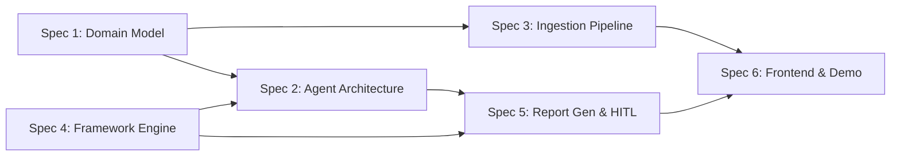

# Portfolio Due Diligence AI Demo — Implementation Plan

## Overview

This project adapts the [aws-samples/sample-genai-market-data-analysis](https://github.com/aws-samples/sample-genai-market-data-analysis) repository to demonstrate automated Onboarding Due Diligence (ODD) and Annual Investment Due Diligence (IDD) for managed portfolios in wealth management.

### Customer Context

A wealth management platform business (Australian context) needs to:
- Conduct due diligence on 600+ portfolios across 35+ investment managers
- Handle 55-70+ reviews annually with only 2 researchers (capacity ~50/year)
- Reduce onboarding cycles from 1-4 months to days
- Automate evidence gathering and report drafting while keeping humans in the loop for assessment decisions

### Existing Sample Architecture (Being Adapted)

| Component | Current | Adapted |
|-----------|---------|---------|
| Backend | Python Strands + AgentCore, 6 agents | Same infra, re-purposed agents |
| Frontend | Next.js + Cognito auth | Extended with DD workflow UI |
| AI Models | Claude 3.7 Sonnet, Llama 4, Nova | Claude 3.7 (primary), Nova (extraction) |
| Data | Parquet stock files + REST API | S3 document packages + Knowledge Bases |
| Output | Markdown + S3 chart images | Board-ready DD report + assessment matrix |

---

## Spec Document Index

| # | Document | Purpose | Dependencies |
|---|----------|---------|--------------|
| 1 | [Domain Model & Data Design](./01-domain-model-data-design.md) | Entities, S3 structure, KB schema, sample data | None |
| 2 | [Agent Architecture & Orchestration](./02-agent-architecture.md) | Agent roles, prompts, tools, orchestration flow | Spec 1 |
| 3 | [Document Ingestion Pipeline](./03-ingestion-pipeline.md) | Multi-format extraction, indexing, RAG setup | Spec 1 |
| 4 | [Due Diligence Framework Engine](./04-framework-engine.md) | Assessment criteria, rating rubrics, decision logic | None |
| 5 | [Report Generation & HITL](./05-report-generation-hitl.md) | Board paper template, human review workflow | Specs 2, 4 |
| 6 | [Frontend & Demo Scenario](./06-frontend-demo.md) | UI design, demo script, sample data packaging | All above |

---

## Execution Order

**Parallel tracks:**
- Track A: Spec 1 → Spec 3 (data layer)
- Track B: Spec 4 → Spec 5 (logic layer)
- Merge: Spec 2 (requires both 1 and 4) → Spec 6 (requires everything)

---

## Key Design Principles

1. **Extend, don't rewrite** — Maintain the existing Strands/AgentCore infrastructure pattern
2. **Demo-first** — Everything must work in a compelling 15-minute demonstration
3. **Human-in-the-loop** — AI generates drafts; humans make decisions
4. **Evidence-grounded** — Every claim must cite a source document and page
5. **Framework-driven** — Assessment is deterministic and auditable
6. **Australian FSI context** — Realistic for the target customer (AFSL, APRA, AUD)

---

## Success Criteria

| Metric | Target |
|--------|--------|
| Demo duration | 15 minutes end-to-end |
| Criteria assessed | 12 per portfolio |
| Evidence citations | 30-50 per report |
| Time to draft report | < 5 minutes (live demo) |
| Human review items flagged | 2-3 per report (realistic, not overwhelming) |
| Report quality | Suitable as first draft for researcher review |

---

## Technology Stack

| Layer | Technology |
|-------|-----------|
| Agent runtime | Strands SDK + Bedrock AgentCore |
| Primary model | Claude 3.7 Sonnet (assessment, drafting) |
| Extraction model | Amazon Nova (document parsing, simpler tasks) |
| Document processing | Bedrock Data Automation (production) / pre-extracted JSON (demo) |
| Knowledge Base | Bedrock Knowledge Bases + OpenSearch Serverless |
| Orchestration | Strands Swarm pattern (adapting existing) |
| Storage | S3 (documents, reports, extracted content) |
| Frontend | Next.js (existing, extended) |
| Auth | Cognito (existing) |
| Deployment | AgentCore (backend) + ECS Fargate or S3+CloudFront (frontend) |
