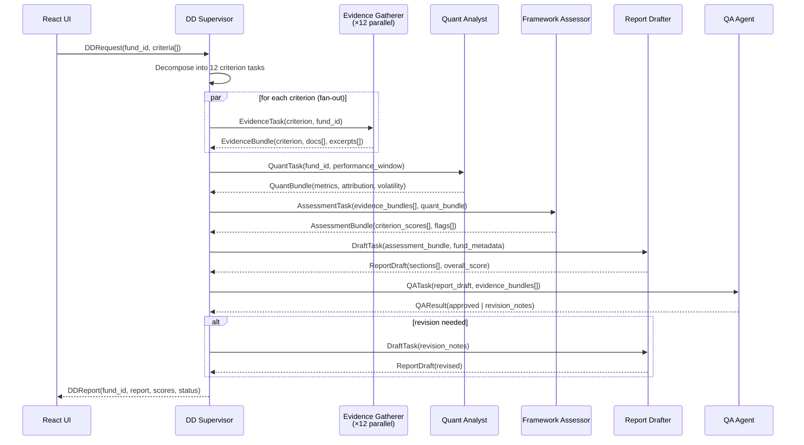

# Spec 02: Agent Architecture for Portfolio Due Diligence

**Package:** `wealth_management_portal.portfolio_dd`  
**Path:** `packages/portfolio_dd/`  
**Runtime:** Python 3.12, Strands SDK, Bedrock AgentCore, FastAPI, Lambda

---

## 1. Architecture Overview



---

## 2. Agent Definitions

### 2.1 DD Supervisor

**Role:** Orchestrator. Decomposes DD requests, fans out to specialist agents, assembles the final report.

**System prompt summary:**
- You coordinate a multi-agent due diligence pipeline for Australian managed funds.
- Delegate evidence gathering (12 criteria in parallel), quantitative analysis, scoring, drafting, and QA to specialist agents.
- Never assess criteria yourself; always route to the appropriate specialist and aggregate results.

**Tools:** `invoke_agent(agent_id, payload)` (A2A calls to child agents)

| Input | Output |
|-------|--------|
| `DDRequest` | `DDReport` |

---

### 2.2 Evidence Gatherer

**Role:** Retrieves supporting evidence for one DD criterion from knowledge base and document store.

**System prompt summary:**
- You retrieve factual evidence for a single due diligence criterion from fund documents and knowledge base.
- Return only grounded excerpts with source citations; do not score or interpret.
- If evidence is insufficient, flag `evidence_gap=True` in your output.

**Tools:** `kb_search(query, fund_id, top_k)`, `get_document_excerpt(doc_id, passage_ids[])`

| Input | Output |
|-------|--------|
| `EvidenceTask` | `EvidenceBundle` |

---

### 2.3 Framework Assessor

**Role:** Scores each criterion against the 12-point DD framework using gathered evidence and quant data.

**System prompt summary:**
- You apply the DD scoring rubric to evidence bundles and quantitative data for each of 12 weighted criteria.
- Produce a numeric score (0–10), a confidence level, and supporting rationale for every criterion.
- Flag any conflicts between evidence sources or missing data that affect score reliability.

**Tools:** `load_rubric(criterion_id)`, `get_benchmark_thresholds(criterion_id)`

| Input | Output |
|-------|--------|
| `AssessmentTask` | `AssessmentBundle` |

---

### 2.4 Quantitative Analyst

**Role:** Extracts and computes quantitative metrics (returns, risk, attribution) from Redshift.

**System prompt summary:**
- You calculate quantitative performance and risk metrics for a fund over a specified window.
- Use only structured data from the data warehouse; do not infer from documents.
- Return metrics in a standardised schema suitable for the Framework Assessor.

**Tools:** `extract_performance_data(fund_id, window)`, `calculate_metrics(raw_data)`

| Input | Output |
|-------|--------|
| `QuantTask` | `QuantBundle` |

---

### 2.5 Report Drafter

**Role:** Generates the structured DD report narrative from assessment scores and fund metadata.

**System prompt summary:**
- You write professional-grade due diligence report sections from scored criteria and quantitative evidence.
- Follow the four-category structure: Investment Process, Risk & Operations, Compliance & ESG, Commercial.
- Produce clear, auditor-ready prose; cite evidence references; flag any criteria rated below 5.

**Tools:** `get_fund_metadata(fund_id)`, `load_report_template(template_id)`

| Input | Output |
|-------|--------|
| `DraftTask` | `ReportDraft` |

---

### 2.6 QA Agent

**Role:** Validates the report draft for factual accuracy, citation coverage, and completeness.

**System prompt summary:**
- You verify that every claim in the report draft is supported by a cited evidence bundle or quant metric.
- Check that all 12 criteria are addressed and scores match the narrative.
- Return `approved=True` or a structured list of revision notes keyed by criterion and section.

**Tools:** `cross_check_citations(report_draft, evidence_bundles[])`, `validate_scores(report_draft, assessment_bundle)`

| Input | Output |
|-------|--------|
| `QATask` | `QAResult` |

---

## 3. Core Python Stubs

### 3.1 AgentState Dataclass

```python
# packages/portfolio_dd/wealth_management_portal_portfolio_dd/state.py

from dataclasses import dataclass, field
from enum import Enum
from typing import Any


class CriterionStatus(str, Enum):
    PENDING = "pending"
    GATHERING = "gathering"
    ASSESSED = "assessed"
    FAILED = "failed"


@dataclass
class CriterionState:
    criterion_id: str       # e.g. "investment_philosophy"
    category: str           # e.g. "investment_process"
    weight: float           # e.g. 0.10
    status: CriterionStatus = CriterionStatus.PENDING
    evidence_bundle: dict[str, Any] | None = None
    score: float | None = None
    confidence: float | None = None
    flags: list[str] = field(default_factory=list)


@dataclass
class AgentState:
    session_id: str
    fund_id: str
    fund_name: str
    criteria: dict[str, CriterionState] = field(default_factory=dict)
    quant_bundle: dict[str, Any] | None = None
    assessment_bundle: dict[str, Any] | None = None
    report_draft: dict[str, Any] | None = None
    qa_approved: bool = False
    qa_revision_notes: list[str] = field(default_factory=list)
    iteration: int = 0

    @property
    def overall_score(self) -> float | None:
        scored = [c for c in self.criteria.values() if c.score is not None]
        if not scored:
            return None
        return sum(c.score * c.weight for c in scored) / sum(c.weight for c in scored)

    @property
    def all_evidence_gathered(self) -> bool:
        return all(c.status in (CriterionStatus.ASSESSED, CriterionStatus.FAILED)
                   for c in self.criteria.values())
```

---

### 3.2 Inter-Agent Message Schema (Pydantic v2)

```python
# packages/portfolio_dd/wealth_management_portal_portfolio_dd/schemas.py
from __future__ import annotations
from typing import Any
from pydantic import BaseModel, Field

class DDRequest(BaseModel):
    session_id: str; fund_id: str; fund_name: str
    criteria_ids: list[str] = Field(default_factory=list)   # empty = all 12

class EvidenceTask(BaseModel):
    session_id: str; fund_id: str; criterion_id: str; criterion_label: str

class EvidenceBundle(BaseModel):
    criterion_id: str
    excerpts: list[dict[str, Any]]   # [{doc_id, passage, source_url}]
    evidence_gap: bool = False

class QuantTask(BaseModel):
    session_id: str; fund_id: str; window_years: int = 3

class QuantBundle(BaseModel):
    fund_id: str
    annualised_return: float | None; volatility: float | None
    sharpe_ratio: float | None; max_drawdown: float | None
    benchmark_excess_return: float | None
    attribution: dict[str, float] = Field(default_factory=dict)

class AssessmentTask(BaseModel):
    session_id: str; fund_id: str
    evidence_bundles: list[EvidenceBundle]; quant_bundle: QuantBundle

class CriterionScore(BaseModel):
    criterion_id: str; score: float; confidence: float   # score 0–10, confidence 0–1
    rationale: str; flags: list[str] = Field(default_factory=list)

class AssessmentBundle(BaseModel):
    fund_id: str; criterion_scores: list[CriterionScore]; overall_score: float

class DraftTask(BaseModel):
    session_id: str; fund_id: str; assessment_bundle: AssessmentBundle
    revision_notes: list[str] = Field(default_factory=list)

class ReportSection(BaseModel):
    category: str; title: str; content: str; criteria_covered: list[str]

class ReportDraft(BaseModel):
    fund_id: str; overall_score: float
    recommendation: str   # "Approved" | "Conditional" | "Not Approved"
    sections: list[ReportSection]; generated_at: str

class QATask(BaseModel):
    session_id: str; report_draft: ReportDraft
    evidence_bundles: list[EvidenceBundle]; assessment_bundle: AssessmentBundle

class QAResult(BaseModel):
    approved: bool; revision_notes: list[str] = Field(default_factory=list)

class DDReport(BaseModel):
    session_id: str; fund_id: str; fund_name: str
    report: ReportDraft; qa_iterations: int
    status: str   # "complete" | "failed"
```

> Transport: `model_dump_json()` / `model_validate_json()` for all A2A calls.

---

### 3.3 DD Supervisor Agent Stub

```python
# packages/portfolio_dd/wealth_management_portal_portfolio_dd/supervisor_agent/agent.py
import asyncio, os
from strands import Agent, tool
from strands.models.bedrock import BedrockModel
from ..schemas import EvidenceTask, QuantTask
from ..state import AgentState, CriterionStatus
from ..criteria import CRITERIA_REGISTRY
from ..common.a2a_client import invoke_agent

SYSTEM_PROMPT = """You are the DD Supervisor for a portfolio due diligence platform.
Coordinate 12 Evidence Gatherers (parallel), one Quant Analyst, one Framework Assessor,
one Report Drafter, and one QA Agent. Never assess criteria yourself.
Aggregate agent outputs and return a complete DDReport."""


@tool
async def gather_all_evidence(state: AgentState) -> AgentState:
    """Fan-out: dispatch EvidenceTasks to 12 Evidence Gatherer agents concurrently."""
    ep = os.environ["EVIDENCE_GATHERER_ENDPOINT"]
    coros = [
        invoke_agent(ep, EvidenceTask(session_id=state.session_id, fund_id=state.fund_id,
                                      criterion_id=cid, criterion_label=meta.label).model_dump_json())
        for cid, meta in CRITERIA_REGISTRY.items()
    ]
    for cid, result in zip(CRITERIA_REGISTRY.keys(), await asyncio.gather(*coros, return_exceptions=True)):
        cs = state.criteria[cid]
        if isinstance(result, Exception):
            cs.status = CriterionStatus.FAILED; cs.flags.append(str(result))
        else:
            cs.evidence_bundle = result; cs.status = CriterionStatus.GATHERING
    return state

@tool
async def run_quant_analysis(state: AgentState) -> AgentState:
    """Invoke Quant Analyst and store QuantBundle in state."""
    ep = os.environ["QUANT_ANALYST_ENDPOINT"]
    result = await invoke_agent(ep, QuantTask(session_id=state.session_id, fund_id=state.fund_id).model_dump_json())
    state.quant_bundle = result
    return state

TOOLS = [gather_all_evidence, run_quant_analysis]

def create_agent() -> Agent:
    return Agent(
        name="DD Supervisor",
        description="Orchestrates the full portfolio due diligence pipeline.",
        model=BedrockModel(model_id=os.environ.get("DD_SUPERVISOR_MODEL_ID", "us.anthropic.claude-sonnet-4-6")),
        system_prompt=SYSTEM_PROMPT, tools=TOOLS, callback_handler=None,
    )
```

---

### 3.4 Evidence Gatherer Tool Signatures

```python
# packages/portfolio_dd/wealth_management_portal_portfolio_dd/evidence_gatherer/tools.py
from strands import tool

@tool
def kb_search(query: str, fund_id: str, top_k: int = 5) -> list[dict]:
    """Search Bedrock Knowledge Base for fund documents matching the criterion query.
    Returns: list of {doc_id, passage, score, source_uri}."""
    ...

@tool
def get_document_excerpt(doc_id: str, passage_ids: list[str]) -> dict:
    """Retrieve specific passages from an S3 fund document.
    Returns: {doc_id, passages: [{id, text, page}], retrieved_at}."""
    ...
```

---

### 3.5 Quant Analyst Tool Signatures

```python
# packages/portfolio_dd/wealth_management_portal_portfolio_dd/quant_analyst/tools.py
from strands import tool

@tool
def extract_performance_data(fund_id: str, window_years: int = 3) -> dict:
    """Query Redshift `fund_performance` for NAV time-series (1–10 yr window).
    Returns: {fund_id, returns: [{date, nav, benchmark_nav}], metadata}."""
    ...

@tool
def calculate_metrics(raw_data: dict) -> dict:
    """Compute standardised risk/return metrics from raw performance data.

    Args:
        raw_data: Output of extract_performance_data.

    Returns:
        {annualised_return, volatility, sharpe_ratio, max_drawdown,
         benchmark_excess_return, attribution: {factor: contribution}}.
    """
    ...
```

---

## 4. AgentCore Deployment Config

### `.bedrock_agentcore.yaml` (snippet)

```yaml
# packages/portfolio_dd/.bedrock_agentcore.yaml

agents:
  - name: dd-supervisor
    entry_point: wealth_management_portal_portfolio_dd.supervisor_agent.main:serve
    protocol: http
    port: 8080
    memory:
      type: dynamodb
      table: "${DD_SESSION_TABLE}"

  - name: evidence-gatherer
    entry_point: wealth_management_portal_portfolio_dd.evidence_gatherer.main:serve
    protocol: http
    port: 8081
    concurrency: 12   # one instance per criterion in parallel fan-out

  - name: quant-analyst
    entry_point: wealth_management_portal_portfolio_dd.quant_analyst.main:serve
    protocol: http
    port: 8082

  - name: framework-assessor
    entry_point: wealth_management_portal_portfolio_dd.framework_assessor.main:serve
    protocol: http
    port: 8083

  - name: report-drafter
    entry_point: wealth_management_portal_portfolio_dd.report_drafter.main:serve
    protocol: http
    port: 8084

  - name: qa-agent
    entry_point: wealth_management_portal_portfolio_dd.qa_agent.main:serve
    protocol: http
    port: 8085

knowledge_base:
  kb_id: "${BEDROCK_KB_ID}"
  data_source: s3
  bucket: "${DD_DOCUMENTS_BUCKET}"
```

### Environment Variables

| Variable | Default / Example | Notes |
|----------|-------------------|-------|
| `DD_SUPERVISOR_MODEL_ID` | `us.anthropic.claude-sonnet-4-6` | Orchestration + drafting agents |
| `EVIDENCE_GATHERER_MODEL_ID` | `us.anthropic.claude-haiku-4-5` | High-concurrency leaf agents |
| `QUANT_ANALYST_MODEL_ID` | `us.anthropic.claude-haiku-4-5` | |
| `FRAMEWORK_ASSESSOR_MODEL_ID` | `us.anthropic.claude-sonnet-4-6` | |
| `REPORT_DRAFTER_MODEL_ID` | `us.anthropic.claude-sonnet-4-6` | |
| `QA_AGENT_MODEL_ID` | `us.anthropic.claude-haiku-4-5` | |
| `BEDROCK_KB_ID` | `ABCDEF1234` | Bedrock Knowledge Base |
| `DD_DOCUMENTS_BUCKET` | `wmp-dd-documents-prod` | S3 fund documents |
| `DD_SESSION_TABLE` | `wmp-dd-sessions` | DynamoDB agent memory |
| `REDSHIFT_WORKGROUP` | `wmp-analytics` | Quant data source |
| `REDSHIFT_DATABASE` | `wealth_platform` | |
| `EVIDENCE_GATHERER_ENDPOINT` | `http://evidence-gatherer:8081` | A2A; localhost fallback in §5 |
| `QUANT_ANALYST_ENDPOINT` | `http://quant-analyst:8082` | |
| `FRAMEWORK_ASSESSOR_ENDPOINT` | `http://framework-assessor:8083` | |
| `REPORT_DRAFTER_ENDPOINT` | `http://report-drafter:8084` | |
| `QA_AGENT_ENDPOINT` | `http://qa-agent:8085` | |
| `MAX_QA_ITERATIONS` | `2` | Report revision cap |

---

## 5. Local Dev Pattern

All agents fall back to `localhost` when `*_ENDPOINT` env vars are unset, matching the pattern used in `advisor_chat`.

```python
# packages/portfolio_dd/wealth_management_portal_portfolio_dd/common/a2a_client.py

import os
import httpx
from typing import Any

# Port map matches .bedrock_agentcore.yaml ports for local docker-compose
_LOCAL_PORTS: dict[str, int] = {
    "dd-supervisor":       8080,
    "evidence-gatherer":   8081,
    "quant-analyst":       8082,
    "framework-assessor":  8083,
    "report-drafter":      8084,
    "qa-agent":            8085,
}

_ENV_KEYS: dict[str, str] = {
    "evidence-gatherer":  "EVIDENCE_GATHERER_ENDPOINT",
    "quant-analyst":      "QUANT_ANALYST_ENDPOINT",
    "framework-assessor": "FRAMEWORK_ASSESSOR_ENDPOINT",
    "report-drafter":     "REPORT_DRAFTER_ENDPOINT",
    "qa-agent":           "QA_AGENT_ENDPOINT",
}


def get_agent_endpoint(agent_name: str) -> str:
    """Return configured endpoint or localhost fallback for local dev."""
    env_key = _ENV_KEYS.get(agent_name)
    if env_key:
        override = os.environ.get(env_key)
        if override:
            return override
    port = _LOCAL_PORTS[agent_name]
    return f"http://localhost:{port}"


async def invoke_agent(endpoint: str, payload_json: str) -> Any:
    """POST a JSON payload to an agent's /invocations endpoint (A2A)."""
    async with httpx.AsyncClient(timeout=120.0) as client:
        resp = await client.post(
            f"{endpoint}/invocations",
            content=payload_json,
            headers={"Content-Type": "application/json"},
        )
        resp.raise_for_status()
        return resp.json()
```

**Local startup (all 6 agents):**

```bash
# Terminal per agent — or use docker-compose
PORT=8080 uv run python -m wealth_management_portal_portfolio_dd.supervisor_agent.main
PORT=8081 uv run python -m wealth_management_portal_portfolio_dd.evidence_gatherer.main
PORT=8082 uv run python -m wealth_management_portal_portfolio_dd.quant_analyst.main
PORT=8083 uv run python -m wealth_management_portal_portfolio_dd.framework_assessor.main
PORT=8084 uv run python -m wealth_management_portal_portfolio_dd.report_drafter.main
PORT=8085 uv run python -m wealth_management_portal_portfolio_dd.qa_agent.main
```

---

## Appendix: DD Criteria Registry

```python
# packages/portfolio_dd/wealth_management_portal_portfolio_dd/criteria.py
from dataclasses import dataclass

@dataclass
class CriterionMeta:
    label: str
    category: str
    weight: float   # fraction of total score (all weights sum to 1.0)

CRITERIA_REGISTRY: dict[str, CriterionMeta] = {
    "investment_philosophy":      CriterionMeta("Investment Philosophy & Process", "investment_process", 0.10),
    "portfolio_construction":     CriterionMeta("Portfolio Construction",          "investment_process", 0.08),
    "performance_attribution":    CriterionMeta("Performance Attribution",         "investment_process", 0.07),
    "benchmark_appropriateness":  CriterionMeta("Benchmark Appropriateness",       "investment_process", 0.05),
    "risk_management":            CriterionMeta("Risk Management Framework",        "risk_operations",   0.10),
    "operational_infrastructure": CriterionMeta("Operational Infrastructure",      "risk_operations",   0.08),
    "key_person_risk":            CriterionMeta("Key Person Risk",                  "risk_operations",   0.07),
    "business_continuity":        CriterionMeta("Business Continuity",             "risk_operations",   0.05),
    "regulatory_compliance":      CriterionMeta("Regulatory Compliance",           "compliance_esg",    0.12),
    "esg_integration":            CriterionMeta("ESG Integration",                 "compliance_esg",    0.08),
    "conflicts_of_interest":      CriterionMeta("Conflicts of Interest",           "compliance_esg",    0.05),
    "fee_transparency":           CriterionMeta("Fee Transparency",                "commercial",        0.08),
    "business_viability":         CriterionMeta("Business Viability",              "commercial",        0.07),
}

SAMPLE_FUNDS = [
    "amp-growth-fund", "pendal-australian-equities", "macquarie-income-fund",
    "australian-ethical-balanced", "hyperion-australian-growth",
]
```
